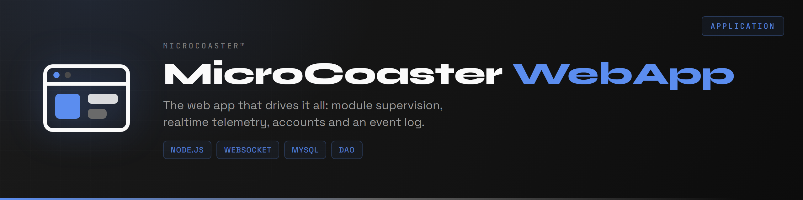
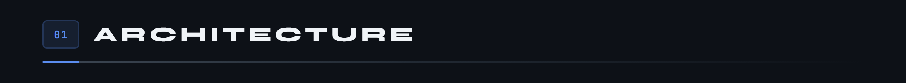
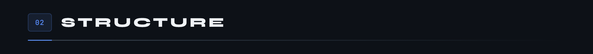
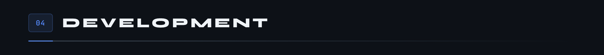

<div align="center">

<p>
  <a href="README.md"></a>
  
</p>



</div>

The web application that drives MicroCoaster layouts. It discovers the connected ESP32 modules, shows their state in real time, and lets you build sequences that orchestrate a whole layout.

Live at **[app.microcoaster.com](https://app.microcoaster.com)**.



The application talks to two worlds that do not have the same needs, so it uses two separate channels.


**Socket.io towards the browsers.** Automatic reconnection, a long-polling fallback, one room per user. It is comfortable on the web side and it tolerates a temperamental network.

**Raw WebSocket towards the ESP32s.** No extra layer, no transport negotiation: a microcontroller has neither the memory nor the need for a Socket.io client. The modules authenticate on connection, then exchange short JSON messages.

This is also where the system's authority sits. A module never decides to move on its own: it carries out an order from this application, which is the only one that knows the full state of the layout.




The `sim/` folder deserves a word: it holds simulators that pass themselves off as real modules. You develop and test the orchestration of a complete layout without having to wire anything at all.


```bash
git clone https://github.com/Microcoaster/MicroCoasterWebApp.git
cd MicroCoasterWebApp
npm install
cp .env.example .env
```

Fill in `.env`, then create the database:

```bash
mysql -u root -p < sql/schema.sql
mysql -u root -p < sql/default_data.sql
```



```bash
npm start           # start
npm test            # tests
npx eslint .        # static analysis
```

The cycle is the organisation's: an issue describes the work, a branch starts from `develop`, a pull request comes back onto it and goes through review before reaching `main`.


The modules driven by this application each have their own repository: [Switch Track](https://github.com/Microcoaster/Switch-Track), [Launch Track](https://github.com/Microcoaster/Launch-Track), [Lift Hill](https://github.com/Microcoaster/Lift-Hill), [Audio module](https://github.com/Microcoaster/Module-Audio), [Smoke Machine](https://github.com/Microcoaster/Smoke-Machine). The common base is the [WiFi Manager](https://github.com/Microcoaster/MicroCoaster_WifiManager).

---

<sub>MicroCoaster · Authors: Cybertrist, Yamakajump</sub>
