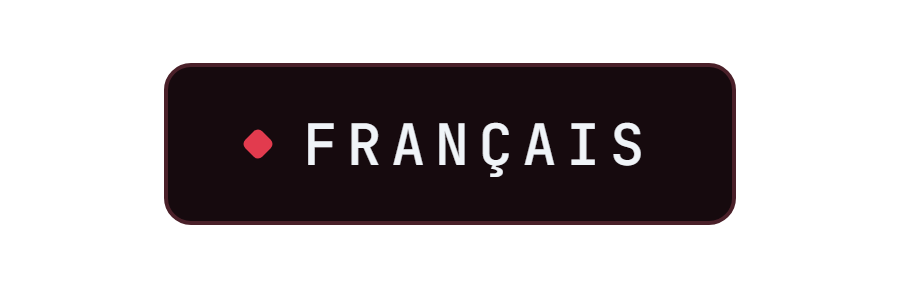
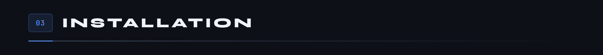
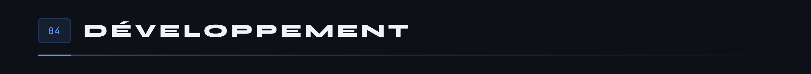
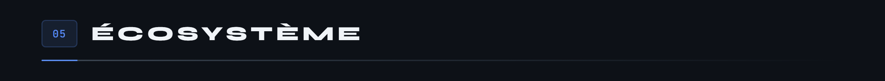

<div align="center">

<p>
  
  <a href="README.en.md"></a>
</p>


</div>

Application web de pilotage des circuits MicroCoaster. Elle découvre les modules ESP32 connectés, affiche leur état en temps réel, et permet de composer des séquences qui orchestrent un circuit entier.

En production sur **[app.microcoaster.com](https://app.microcoaster.com)**.


L'application parle à deux mondes qui n'ont pas les mêmes besoins, et utilise donc deux canaux distincts.


**Socket.io vers les navigateurs.** Reconnexion automatique, repli sur du long polling, salles par utilisateur. C'est confortable côté web et ça tolère un réseau capricieux.

**WebSocket natif vers les ESP32.** Pas de surcouche, pas de négociation de transport : un microcontrôleur n'a ni la mémoire ni le besoin d'un client Socket.io. Les modules s'authentifient à la connexion, puis échangent des messages JSON courts.

C'est aussi ici que se concentre l'autorité du système. Un module ne décide jamais seul de bouger : il exécute un ordre venu de cette application, qui est la seule à connaître l'état complet du circuit.


Le dossier `sim/` mérite un mot : il contient des simulateurs qui se font passer pour de vrais modules. On développe et on teste l'orchestration d'un circuit complet sans avoir à câbler quoi que ce soit.



```bash
git clone https://github.com/Microcoaster/MicroCoasterWebApp.git
cd MicroCoasterWebApp
npm install
cp .env.example .env
```

Renseigner `.env`, puis créer la base :

```bash
mysql -u root -p < sql/schema.sql
mysql -u root -p < sql/default_data.sql
```



```bash
npm start           # démarrage
npm test            # tests
npx eslint .        # analyse statique
```

Le cycle est celui de l'organisation : une issue décrit le travail, une branche part de `develop`, une pull request revient dessus et passe en review avant d'atteindre `main`.



Les modules pilotés par cette application ont chacun leur dépôt : [Switch Track](https://github.com/Microcoaster/Switch-Track), [Launch Track](https://github.com/Microcoaster/Launch-Track), [Lift Hill](https://github.com/Microcoaster/Lift-Hill), [Module Audio](https://github.com/Microcoaster/Module-Audio), [Smoke Machine](https://github.com/Microcoaster/Smoke-Machine). Le socle commun est le [WiFi Manager](https://github.com/Microcoaster/MicroCoaster_WifiManager).

---

<sub>MicroCoaster · Auteurs : Cybertrist, Yamakajump</sub>
